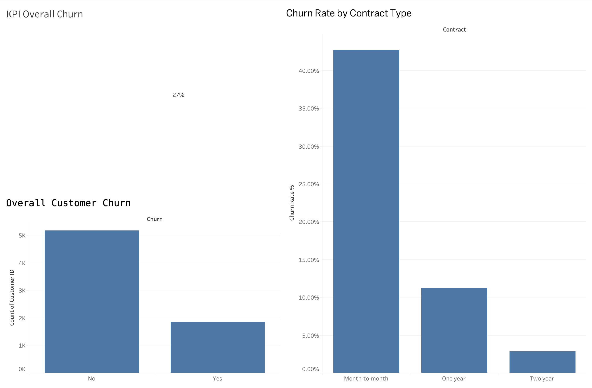
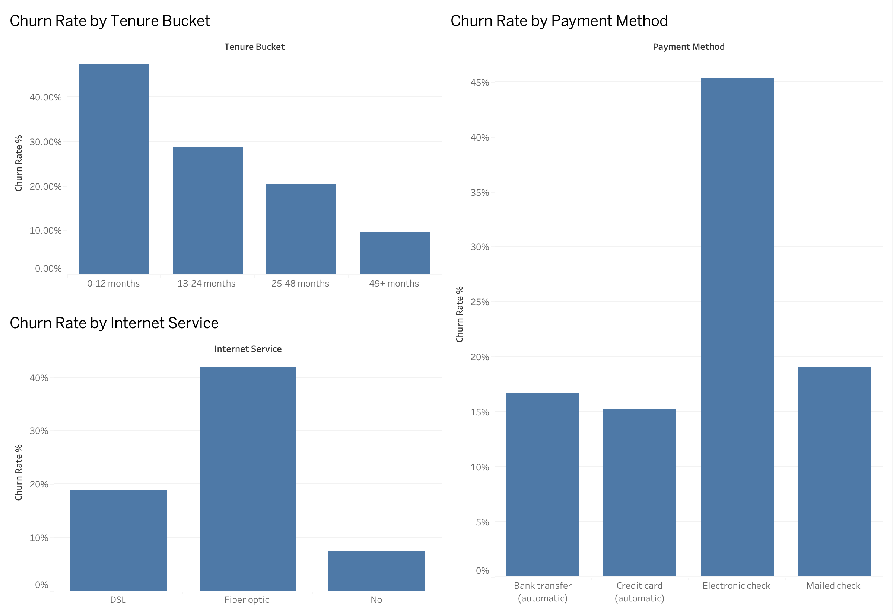
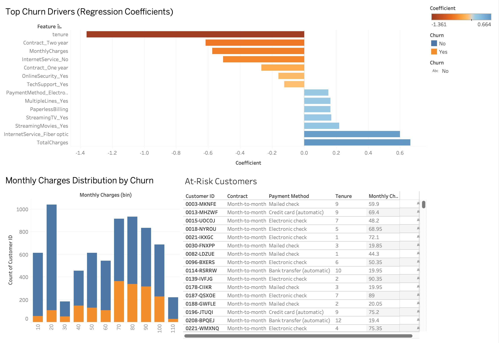

# 📊 ChurnLens — Customer Churn Analysis & Retention Playbook

A full-cycle churn analysis project on the IBM Telco Customer Churn dataset, combining **SQL, Python, and Tableau** to identify why customers leave and translate those findings into a prioritized, revenue-quantified retention playbook.

---

## 🔍 Summary

Telecom-style subscription businesses lose roughly a quarter of their customers every cycle — but not evenly. This project digs into **7,043 customer records** to find exactly *who* is leaving, *why*, and *what it's costing the business*, then packages those findings into a playbook a retention team could act on tomorrow.

## 💼 Business Case

Customer acquisition is expensive; retention is cheap by comparison. A 5% improvement in retention can meaningfully move the bottom line for a subscription business, but only if the right customers are targeted with the right intervention. This project identifies the **highest-leverage segments** — new customers, month-to-month + electronic-check payers, and customers without protective add-ons — and quantifies the **revenue currently at risk** in each, so retention spend can be prioritized where it matters most rather than spread thin.

---

## Project Overview

ChurnLens answers four questions for a telecom-style subscription business:
1. **How much churn is happening, and where?** (SQL + EDA)
2. **What actually drives churn, independent of other factors?** (correlation + logistic regression)
3. **What does it look like at a glance?** (3-page Tableau dashboard)
4. **What should the business actually do about it?** (Churn Playbook with revenue-at-risk figures)

---

## 🎯 Key Findings

- **Overall churn rate: 26.5%** of customers have churned.
- **Tenure is the strongest predictor of churn** across every method used (SQL, correlation, and regression) — customers in their first 12 months churn at **47.4%**, compared to **9.5%** for customers with 49+ months tenure.
- **Contract type is the second-strongest driver**: month-to-month customers churn at **42.7%**, versus **11.3%** for one-year and **2.8%** for two-year contracts — a 15x spread.
- **The single highest-risk segment**: month-to-month customers paying by electronic check churn at **53.7%** — the riskiest combination in the entire dataset.
- **Customers lacking OnlineSecurity and TechSupport** churn at roughly 3x the rate of those with both, and this segment alone represents **$1.13M in annual revenue at risk**.
- **Fiber optic internet customers show independently elevated churn risk**, even after controlling for price and contract type — a signal worth investigating from a service-quality angle.

Full methodology and supporting queries are in `sql/` and `python/01_eda.ipynb`.

---

## 📈 Dashboard

Built in **Tableau Public** (not Power BI — this project was built on macOS, and Power BI Desktop is Windows-only; Tableau Public was chosen as the closest equivalent free tool with full authoring support on Mac).

### Overview
KPI summary, overall churn split, and churn rate by contract type.


### Segmentation
Churn rate broken down by tenure bucket, payment method, and internet service type.


### Leading Indicators & At-Risk Customers
Regression-based feature importance, monthly charge distribution by churn, and a live filtered table of currently active, high-risk customers.


---

## 📋 Churn Playbook

A business-facing action plan translating the analysis into prioritized retention actions (trigger → segment → action → owner → revenue at risk). See the full table in [`playbook/churn_playbook.md`](playbook/churn_playbook.md).

Top priority: customers lacking both OnlineSecurity and TechSupport represent **$1.13M in annual revenue at risk** — the single largest quantified opportunity identified.

---

## 🛠️ Tech Stack

- **SQL** (SQLite) — churn trend analysis, tenure bucketing, service usage, contract/payment cross-analysis
- **Python** (pandas, matplotlib, seaborn, scikit-learn) — data cleaning, EDA, correlation analysis, logistic regression for feature interpretability
- **Tableau Public** — 3-page interactive dashboard
- **Git/GitHub** — version control

---

## Reproducing This Project

```bash
# Clone the repo
git clone https://github.com/drikshathakur786/churnlens-customer-retention-analytics.git
cd churnlens-customer-retention-analytics

# Set up the Python environment
python3 -m venv venv
source venv/bin/activate
pip install -r requirements.txt

# Launch the notebook
jupyter notebook python/01_eda.ipynb
```

The SQL queries in `sql/` run directly against `data/processed/churnlens.db` (SQLite) and can be run independently via any SQLite client, or from within the notebook as shown in `01_eda.ipynb`.

The Tableau workbook (`dashboard/ChurnLens_Dashboard.twb`) references `data/processed/telco_churn_cleaned.csv` and `data/processed/churn_drivers.csv` by relative path — opening it from within the cloned repo structure should resolve both automatically.

---

## Data Source

[Telco Customer Churn dataset](https://www.kaggle.com/datasets/blastchar/telco-customer-churn) (IBM sample data, via Kaggle).

---

## Author

Driksha Thakur